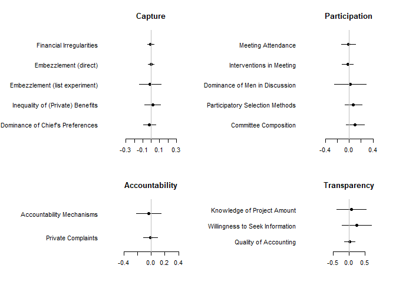
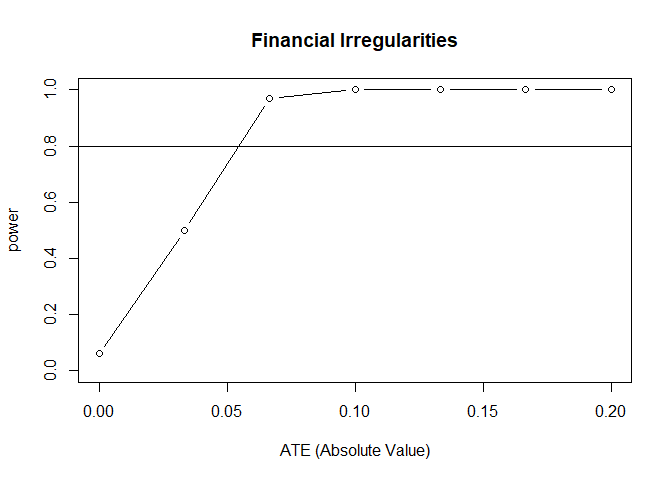

Exporting Democratic Practices: Evidence from a Village Governance
Intervention in East Congo
================
Macartan Humphreys, Raul Sanchez de la Sierra, Peter van der Windt
07 August, 2019

  - [Preliminaries](#preliminaries)
      - [Options](#options)
      - [Definitions](#definitions)
      - [Run Helper Code](#run-helper-code)
      - [Get Data](#get-data)
      - [Prepare Dataset and Variables](#prepare-dataset-and-variables)
  - [Table 2: Results on Public Fund
    Allocation](#table-2-results-on-public-fund-allocation)
  - [Table 3: Results on Democratic
    Practices](#table-3-results-on-democratic-practices)
  - [Table 4: Tuungane Balance Table](#table-4-tuungane-balance-table)
      - [Table 4b: RAPID Balance Table
        (Supplementary)](#table-4b-rapid-balance-table-supplementary)
  - [Table 5: Summary Statistics](#table-5-summary-statistics)
  - [Tables 6 and 7: Spillovers](#tables-6-and-7-spillovers)
  - [Table 8: Social Desirability](#table-8-social-desirability)
  - [Table 9: Robustness](#table-9-robustness)
  - [Table 10: Heterogeneous Effects by Initial
    Institutions](#table-10-heterogeneous-effects-by-initial-institutions)
  - [Figure 1: Map Tuungane Treatment and
    Control](#figure-1-map-tuungane-treatment-and-control)
  - [Figure 2: Timeline](#figure-2-timeline)
  - [Figure 3: Main Results](#figure-3-main-results)
  - [Figure 4: Spillovers](#figure-4-spillovers)
  - [Figure 6: Minimal Detectable
    Effects](#figure-6-minimal-detectable-effects)
  - [Figure 5: Information for Consort
    Chart](#figure-5-information-for-consort-chart)
      - [Step A Information](#step-a-information)
      - [Step B Information](#step-b-information)
      - [Step D Information](#step-d-information)
  - [Additional statistics](#additional-statistics)

This file replicates the core analysis as well as additional results of
[Humphreys, M., de la Sierra, R. S., & Van der Windt, P. (2019).
Exporting democratic practices: Evidence from a village governance
intervention in Eastern Congo. *Journal of Development
Economics*](https://www.sciencedirect.com/science/article/pii/S0304387818305078).

  - Data for this analysis is [available on
    Dataverse](https://dataverse.harvard.edu/dataset.xhtml?persistentId=doi:10.7910/DVN/BSASJR)
    and can be sourced directly from the Dataverse server with the
    option below (`local_data <- FALSE`) or locally from folder “Data”.

  - Supporting code including this page is [available on
    Github](https://github.com/macartan/replication_jde2019_drc). The
    code outputs tables and figures into the folder “Output”, which are
    then sourced in from the LaTeX file of the manuscript.

# Preliminaries

## Options

Options can be set to use data from data folder or directly from
dataverse. Note that if you ar e using this from public repositories
then you have access to all code and almost all data but you do not have
access to fine grained GPS data and so `with_GPS` should be set to
`FALSE`. All analysis will still run although (a) spillover analysis
will be implemented using summary data without GPS codes (b) maps will
not be produced.

``` r
# load data locally (TRUE) or from dataverse (FALSE)
local_data <- FALSE
local_datapath = "Data"

# save figure and tables to output folder
saving <- TRUE
output_folder <- "Output"

# Set number simulatons used for calculating propensities and for the randomization inference p-values
spilloversims <- 5000 #5000 takes a long time, consider lowering for speediness

# Reproduce outputs requiring GPS data (usually set to `FALSE` since precise gps not publicly available)
with_GPS <- FALSE

# Save geodeidentified data, if geo data available  (usually set to `FALSE` since precise gps not publicly available)
save_geodeidentified_data <- FALSE
if(!with_GPS) save_geodeidentified_data <- FALSE
```

## Definitions

``` r
# List indicators of main outcome (capture)

capture_var_names <- c(
  "Financial Irregularities",
  "Embezzlement (direct)",
  "Embezzlement (list experiment)",
  "Inequality of (Private) Benefits",
  "Dominance of Chief's Preferences")

# List indicators of mechanisms (participation, accountability, transparency)

mech_var_names = c(
  "Meeting Attendance",
  "Interventions in Meeting",
  "Dominance of Men in Discussion",
  "Participatory Selection Methods",
  "Committee Composition",
  "Accountability Mechanisms", 
  "Private Complaints", 
  "Knowledge of Project Amount",
  "Willingness to Seek Information",
  "Quality of Accounting"
)

varnames <- c(capture_var_names, mech_var_names)
varnames2 <- paste(rbind(varnames, rep("",length(varnames))))
```

## Run Helper Code

Script to create helper functions that will be used in the remainder of
the replication.

``` r
source("Code/0 HelperFunctions.R")
```

## Get Data

### Local data

``` r
if(local_data){
  abd_vill     <- load_file("DRC2012_ABD_VILL_v2.dta") 
  abd_ind      <- load_file("DRC2012_ABD_INDIV_v2.dta")
  tuungane     <- load_file("TUUNGANE_v2.dta")
  irc_tuungane <- load_file("irc_tuungane.dta")
  audit        <- load_file("DRC2012_D_AUDIT_v2.dta") 
  abd_disc     <- load_file("DRC2012_A_DISC_v2.dta")   
  roster       <- load_file("DRC2012_D_ROSTER_v2.dta")
  cdcdata      <- load_file("gps/IDV_WEIGHTS_201203.dta")
  D            <- load_file("Dates_medians.dta")
  idv_dists    <- load_file("idv_distances.dta")
}
```

### Data on `Dataverse`

``` r
if(!local_data){
  library(dataverse)             
  Sys.setenv("DATAVERSE_SERVER" = "dataverse.harvard.edu")

  f <- function(filename, extension = ".tab"){
      g   <- get_file(paste0(filename, extension), "doi:10.7910/DVN/BSASJR")
      tmp <- tempfile(fileext = ".dta")
      writeBin(as.vector(g), tmp)
      read_dta(tmp)}

  abd_vill     <- f("DRC2012_ABD_VILL_v2")    # Village data
  abd_ind      <- f("DRC2012_ABD_INDIV_v2")   # Indiv data
  tuungane     <- f("TUUNGANE_v2")            # Attitudes data for non-Tuungane subset
  irc_tuungane <- f("irc_tuungane")           # IRC Tuungane
  audit        <- f("DRC2012_D_AUDIT_v2")     # Audit data
  abd_disc     <- f("DRC2012_A_DISC_v2")      # Discussion data
  roster       <- f("DRC2012_D_ROSTER_v2")    # Roster
  cdcdata      <- f("IDV_WEIGHTS_201203")     # CDC Data
  D            <- f("Dates_medians")          # Dates
  idv_dists    <- f("idv_distances")          # Adjacency matrix

}
```

### GPS data

Fine grain gps data is not publicly available following privacy
protocols. These can be loaded here if available, otherwise summary data
is used for replication.

``` r
# Raw GPS if available

if(with_GPS){
    X            <- load_file("20140211indirect_5000sims_5km.dta")
    X20          <- load_file("20140211indirect_5000sims_20km.dta")
    GPS          <- load_file("gps/gps_tuungane.dta")
    drc.map.test <- readShapePoly(paste0(local_datapath, "/shapefiles/COD_adm2"))
    col          <- readOGR(dsn = paste0(local_datapath, "/shapefiles"), "collectivite")
  }
```

## Prepare Dataset and Variables

Script prepares data and variables for analysis.

``` r
# Merge subgroup data, treatment info, lottery info, etc. to the datasets
source("Code/1 PrepDatasets.R")
```

Here we prepare data for spillovers analysis. Alongside the gps database
we use:

  - a database of possible direct assignments (dir)
  - a database of possible indirect assignments at 5k (ind05) and 20k
    (ind20)
  - database of inverse propensity weights – these are different
    depending on each assignment becuase they report the probability of
    being assigned to the condition you are assigned to

These datasets are generated here if gps data is available, otherwise
they are imported.

``` r
source("Code/2.1 PrepSpillovers_village_data.R")

if(with_GPS)   source("Code/2.2 PrepSpillovers_rerandomize.R")
if(!with_GPS)  source("Code/2.3 PrepSpillovers_import.R")
```

# Table 2: Results on Public Fund Allocation

Script presents the result on public funds allocation.

``` r
dvs <- c("da109_not_verifiable", 
         "qr026i_fund_misuse",
         #"qr2729_list_experiment", 
         "qr2830_list_experiment",
         "stdev_benefits",
         #"Correct_D_projet"
         "Correct_B_projet")

main_results <- list(
  
  fin_irregul  =  lm_robust(da109_not_verifiable ~ TUUNGANE ,
                            data     = vill, 
                            fixed_effects = LOTT_BIN,
                            weights  = VILL_WEIGHT),
  
  embezzl_dir  = lm_robust(qr026i_fund_misuse ~ TUUNGANE  + as.factor(LOTT_BIN) ,
                           data     = ind, 
                           weights  = VILL_WEIGHT, 
                           clusters = IDS_CDCCODE),
  
  embezzl_list = lm_robust(
    qr2830_list_experiment ~ TUUNGANE + RB + RB*TUUNGANE + as.factor(LOTT_BIN),                 
                           data     = ind,
                           weights  = VILL_WEIGHT,
                           clusters = IDS_CDCCODE),
  
  ineq_benef   = lm_robust(stdev_benefits ~ TUUNGANE , 
                           fixed_effects = LOTT_BIN,
                           data     = vill,
                           weights  = VILL_WEIGHT ),
  
  chief_domin  = lm_robust(
    Correct_B_projet ~ TUUNGANE + CHIEF + CHIEF*TUUNGANE +  as.factor(LOTT_BIN) , 
                           data     = ind,
                           clusters = IDS_CDCCODE,
                           weights  = VILL_WEIGHT))

main_table_pre <- mapply(function(x, name)  { 
  tidy = tidy(x); rownames(tidy) = tidy$term;
  if( name ==  "embezzl_list"   ) 
    round(c(Control   = tidy["RB", "estimate"],
            Control_se   = tidy["RB", "std.error"],
            Effect    = tidy["TUUNGANE:RB", "estimate"],  
            std_error = tidy["TUUNGANE:RB", "std.error"],
            N         = x$N), 3)
  else if(name == "chief_domin")
    round(c(Control   = tidy["CHIEFTRUE", "estimate"],
            Control_se   = tidy["CHIEFTRUE", "std.error"],
            Effect    = tidy["TUUNGANE:CHIEFTRUE", "estimate"],  
            std_error = tidy["TUUNGANE:CHIEFTRUE", "std.error"],
            N         = x$N), 3)
  else
    round(c(Control  = tidy["(Intercept)", "estimate"],
            Control_se  = tidy["(Intercept)", "std.error"],
            Effect    = tidy["TUUNGANE", "estimate"], 
            std_error = tidy["TUUNGANE", "std.error"], 
            N         = x$N ),3)
  
}, main_results, names(main_results))

add_cols <- mapply(function(d, dv){
  d <- d %>% arrange(LOTT_BIN)
  N_cluster <- ifelse(length(unique(d$IDV_CDCCODE[!is.na(d[[dv]])])) > 0,
                      length(unique(d$IDV_CDCCODE[!is.na(d[[dv]])])),
                      length(unique(d$IDS_CDCCODE[!is.na(d[[dv]])])))
  
  #block weights in the data
  d$dv <- d[[dv]][]
  #block average for control
  ave_ctrl_blocks <- d %>% 
    subset(TUUNGANE == 0) %>%
    group_by(LOTT_BIN) %>%
    summarize(block_n = sum(!is.na(dv)),
              ave = mean(dv, na.rm = TRUE)) %>% ungroup() %>%
    mutate(block_w = block_n/nrow(.))
  #weighted average of block averages
  w_ave_ctrl_blocks <- weighted.mean(ave_ctrl_blocks$ave, ave_ctrl_blocks$block_w, na.rm = TRUE)
  #weighted sd of block averages
  w_sd_ctrl_blocks <- sd(d$dv, na.rm = TRUE)
  
  return(round(rbind(w_ave_ctrl_blocks, w_sd_ctrl_blocks, N_cluster), 3))
}, d = list(vill, ind, ind, vill, ind), dv = dvs) %>% t()

main_table <- cbind(control.mean = add_cols[,1], control.sd = add_cols[,2], t(main_table_pre)[,-c(1:2)], N_cluster = add_cols[,3])

#maintain beta1 coefficient and standard error instead of control mean for "embezzl_dir", "chief_domin"
keep_beta1 <- rownames(main_table) %in% c("embezzl_list", "chief_domin")
main_table[keep_beta1, "control.mean"] <- t(main_table_pre)[keep_beta1, "Control"]
main_table[keep_beta1, "control.sd"] <- t(main_table_pre)[keep_beta1, "Control_se"]

kable(main_table)
```

|               | control.mean | control.sd |  Effect | std\_error |    N | N\_cluster |
| ------------- | -----------: | ---------: | ------: | ---------: | ---: | ---------: |
| fin\_irregul  |        0.147 |      0.212 | \-0.006 |      0.020 |  394 |        394 |
| embezzl\_dir  |        0.147 |      0.353 | \-0.001 |      0.018 | 3623 |        411 |
| embezzl\_list |        0.462 |      0.049 | \-0.012 |      0.066 | 3676 |        411 |
| ineq\_benef   |        2.602 |      5.888 |   0.163 |      0.495 |  409 |        409 |
| chief\_domin  |        0.095 |      0.027 | \-0.019 |      0.039 | 2446 |        441 |

# Table 3: Results on Democratic Practices

Script presents the result on democratic practices.

``` r
dvs_mech <- c("PART_A1", "N_INTERV", "MALE_DOM", "MFI_SELECTION", "MFI_COMPOSITION", "MFI_MECHANISMS", "MFI_COMPLAINTS", "qr002CORRECT", "qi003_accept", "MFI_ACCOUNTING")

mechanisms <- list(
  part  =  lm_robust(PART_A1   ~ TUUNGANE ,
                     data = vill, 
                     fixed_effects = LOTT_BIN,
                     weights = VILL_WEIGHT),
  inter =  lm_robust(N_INTERV  ~ TUUNGANE ,
                     data = vill,
                     fixed_effects = LOTT_BIN,
                     weights = VILL_WEIGHT),
  male_d = lm_robust(MALE_DOM  ~ TUUNGANE,
                     data = vill,
                     fixed_effects = LOTT_BIN,
                     weights = VILL_WEIGHT),
  sel    = lm_robust(MFI_SELECTION ~ TUUNGANE ,
                     data = vill,
                     fixed_effects = LOTT_BIN,
                     weights = VILL_WEIGHT),
  compos = lm_robust(MFI_COMPOSITION ~ TUUNGANE,
                     fixed_effects = LOTT_BIN,
                     data = vill, 
                     weights = VILL_WEIGHT),
  mech   = lm_robust(MFI_MECHANISMS  ~ TUUNGANE,
                     data  = vill,
                     fixed_effects = LOTT_BIN,
                     weights = VILL_WEIGHT),
  compl = lm_robust(MFI_COMPLAINTS ~ TUUNGANE + as.factor(LOTT_BIN),
                    data =  ind,
                    weights = VILL_WEIGHT,
                    clusters = IDS_CDCCODE),
  corr  = lm_robust(qr002CORRECT   ~ TUUNGANE + as.factor(LOTT_BIN),
                    data =  ind,
                    weights = VILL_WEIGHT,
                    clusters = IDS_CDCCODE),
  accep = lm_robust(qi003_accept  ~ TUUNGANE + as.factor(LOTT_BIN),
                    data =  ind, 
                    weights = VILL_WEIGHT,
                    clusters = IDS_CDCCODE ),
  accoun = lm_robust(MFI_ACCOUNTING ~ TUUNGANE,
                     data  = vill,
                     fixed_effects = LOTT_BIN,
                     weights = VILL_WEIGHT)
)

mechanisms_table <- mapply(function(x, name){ 
  tidy = tidy(x); rownames(tidy) = tidy$term;
  round(c(Control  = tidy["(Intercept)", "estimate"],
          Effect    = tidy["TUUNGANE", "estimate"], 
          std_error = tidy["TUUNGANE", "std.error"], 
          N         = x$N ),3)
  
}, mechanisms, names(mechanisms))

add_cols <- mapply(function(d, dv){
  d <- d %>% arrange(LOTT_BIN)
  N_cluster <- ifelse(length(unique(d$IDV_CDCCODE[!is.na(d[[dv]])])) > 0,
                      length(unique(d$IDV_CDCCODE[!is.na(d[[dv]])])),
                      length(unique(d$IDS_CDCCODE[!is.na(d[[dv]])])))
  
  #block weights in the data
  d$dv <- d[[dv]][]
  #block average for control
  ave_ctrl_blocks <- d %>% 
    subset(TUUNGANE == 0) %>%
    group_by(LOTT_BIN) %>%
    summarize(block_n = sum(!is.na(dv)),
              ave = mean(dv, na.rm = TRUE)) %>% ungroup() %>%
    mutate(block_w = block_n/nrow(.))
  #weighted average of block averages
  w_ave_ctrl_blocks <- weighted.mean(ave_ctrl_blocks$ave, ave_ctrl_blocks$block_w, na.rm = TRUE)
  #weighted sd of block averages
  w_sd_ctrl_blocks <- sd(d$dv, na.rm = TRUE)
  
  return(round(rbind(w_ave_ctrl_blocks, w_sd_ctrl_blocks, N_cluster), 3))
}, d = list(vill, vill, vill, vill, vill, vill, ind, ind, ind, vill), dv = dvs_mech) %>% t()

mechanisms_table <- cbind(control.mean = add_cols[,1], control.sd = add_cols[,2], t(mechanisms_table)[,-1], N_cluster = add_cols[,3])

kable(mechanisms_table)
```

|         | control.mean | control.sd |  Effect | std\_error |    N | N\_cluster |
| ------- | -----------: | ---------: | ------: | ---------: | ---: | ---------: |
| part    |      132.394 |     79.683 | \-1.199 |      6.297 |  455 |        455 |
| inter   |       14.697 |      5.524 | \-0.267 |      0.483 |  457 |        457 |
| male\_d |       70.255 |     15.018 |   0.161 |      1.360 |  442 |        442 |
| sel     |        0.015 |      0.987 |   0.072 |      0.073 |  451 |        451 |
| compos  |        0.033 |      0.963 |   0.099 |      0.078 |  452 |        452 |
| mech    |        0.007 |      1.021 | \-0.036 |      0.094 |  414 |        413 |
| compl   |        0.015 |      1.019 | \-0.010 |      0.052 | 3658 |        411 |
| corr    |       37.965 |     48.568 |   0.697 |      2.384 | 3699 |        411 |
| accep   |       39.161 |     49.025 |   2.399 |      2.335 | 1407 |        411 |
| accoun  |      \-0.026 |      1.056 |   0.011 |      0.084 |  399 |        399 |

Script to output result tables to .tex files.

``` r
source("Code/3.2 Output_MainResults.R")

if(saving){
  sink(paste0(output_folder, "/Table2_Capture.tex"))
  tablr(T2)
  sink()
  
  sink(paste0(output_folder, "/Table3_Practice.tex"))
  tablr(T3)
  sink()
}
```

# Table 4: Tuungane Balance Table

Create Tuungane balance table.

``` r
# Balance variables
BALANCE_VARS <- c(DIST   = "distance",
                  VILL   = "dist_mine",
                  VILL   = "mineral_index",
                  PUBLIC = "public2006",
                  VILL   = "former_chief_elec",
                  MIG    = "mig2006",  
                  STATS  = "age"
)

# Balance datasets
BALANCE <- list(vill, vill, vill, vill, vill, vill,  as.data.frame(STATS))

# Balance table
balance.table <- sapply(1:length(BALANCE), function(i){
  data <- BALANCE[[i]]
  Y    <- BALANCE_VARS[i]
  balance_function(data[,Y, drop = TRUE],
                   data[,"TUUNGANE", drop = TRUE], 
                   data[,"VILL_WEIGHT", drop = TRUE])}) %>% 
  round(., 2) %>% 
  t()
```

|                                  | Control | Tuungane | d-stat |    N |
| -------------------------------- | ------: | -------: | -----: | ---: |
| Distance from major urban center |    9.27 |     8.96 | \-0.02 |  802 |
| Distance to village mine         |    5.75 |     6.09 |   0.02 |  470 |
| Mineral composition              |    0.84 |     0.78 | \-0.06 |  617 |
| Presence infrastructure in 2006  |    7.67 |     7.01 | \-0.09 |  722 |
| Former chief popular choice      |    0.18 |     0.16 | \-0.05 |  653 |
| In-migration in 2006             |    8.46 |     8.22 | \-0.01 |  607 |
| Age                              |   39.77 |    39.30 | \-0.03 | 5411 |

## Table 4b: RAPID Balance Table (Supplementary)

Create RAPID balance table.

``` r
# Balance table
balance.table.RAPID <- sapply(1:length(BALANCE), function(i){
  data <- BALANCE[[i]]
  Y    <- BALANCE_VARS[i]
  balance_function(data[,Y][],
                   data[,"IDV_RAPID"][], 
                   data[,"IPW_RAPID"][])}) %>% 
  round(., 2) %>% 
  t()
```

|                                  | Control | RAPID | d-stat |    N |
| -------------------------------- | ------: | ----: | -----: | ---: |
| Distance from major urban center |    8.46 |  8.00 | \-0.04 |  802 |
| Distance to village mine         |    8.54 |  3.23 | \-0.21 |  470 |
| Mineral composition              |    1.07 |  0.73 | \-0.25 |  617 |
| Presence infrastructure in 2006  |    7.20 |  7.92 |   0.11 |  722 |
| Former chief popular choice      |    0.12 |  0.14 |   0.05 |  653 |
| In-migration in 2006             |    7.65 | 12.39 |   0.17 |  607 |
| Age                              |   40.01 | 38.60 | \-0.10 | 5411 |

Script to output tables to .tex files.

``` r
source("Code/3.1 Output_BalanceTables.R")

if(saving){
  sink(paste0(output_folder, "/Table4_Balance_TUUNGANE.tex"))
  tablr(T_Balance)
  sink()
}

if(saving){
  sink(paste0(output_folder, "/Table4_Balance_RAPID.tex"))
  tablr(T_Balance_RAPID)
  sink()
}
```

# Table 5: Summary Statistics

``` r
outcomes <- c("RAPID", "TUUNGANE", "da109_not_verifiable", "qr026i_fund_misuse",
              "qr2830_list_experiment","stdev_benefits", "Correct_B_projet",
              "PART_A1", "N_INTERV", "MALE_DOM", "MFI_SELECTION", "MFI_COMPOSITION", 
              "MFI_MECHANISMS","MFI_COMPLAINTS", "qr002CORRECT", "qi003_accept", 
              "MFI_ACCOUNTING")

datasets <- list(cdcdata, cdcdata, vill, 
                 ind,ind,vill,
                 ind, vill, vill,  vill,
                 vill, vill,  vill,ind,                         
                 ind, ind, vill)


sumStats <- mapply(function(y, d){
  
  IDVs <- cdcdata[,"IDV"]
  
  if(y == "qr2830_list_experiment" | y == "Correct_B_projet"){
    
    # subset interactions
    if(y == "qr2830_list_experiment")   {i0 <- d$RB    == 0;i1 <- d$RB    == 1}
    if(y == "Correct_B_projet") {i0 <- d$CHIEF == 0; i1 <- d$CHIEF == 1}
    
    # compute subsetted villmeans 
    villmean_0 <- aggregate(d[i0,c("IDV",y)], by= list(d$IDV[i0]), FUN="mean", na.rm=TRUE) %>%
      select(IDV, X_0 = y)
    villmean_1 <- aggregate(d[i1,c("IDV",y)], by= list(d$IDV[i1]), FUN="mean", na.rm=TRUE)%>%
      select(IDV, X_1 = y)
    
    # Clean up interactions -- Impute means where one side has data present
    villmean    <- merge(IDVs, villmean_0, by = "IDV", all.x = TRUE) %>%
      merge(villmean_1 ,by = "IDV", all.x = TRUE) %>%
      mutate(X_1 = ifelse(is.na(X_1)& !is.na(X_0), mean(X_1, na.rm = TRUE), X_1),
             X_0 = ifelse(!is.na(X_1)&!is.na(X_0), mean(X_0, na.rm = TRUE), X_0),
             X  = X_1 - X_0)
    
  } else {
    
    villmean <-  aggregate(d[,c("IDV",y)], by= list(d$IDV), FUN="mean", na.rm=TRUE) %>%
      select(IDV, X = y)
    
  }
  with(villmean,
       c( N = sum(!is.na(X)), mean = mean(X, na.rm = T), sd = sd(X, na.rm = T) , min = min(X, na.rm = T), max =max(X, na.rm = T)))
},y = outcomes, datasets)

kable(t(sumStats ), digits = 2 )
```

|                          |    N |   mean |    sd |    min |    max |
| ------------------------ | ---: | -----: | ----: | -----: | -----: |
| RAPID                    | 1120 |   0.50 |  0.50 |   0.00 |   1.00 |
| TUUNGANE                 | 1120 |   0.50 |  0.50 |   0.00 |   1.00 |
| da109\_not\_verifiable   |  394 |   0.15 |  0.21 |   0.00 |   1.00 |
| qr026i\_fund\_misuse     |  412 |   0.15 |  0.22 |   0.00 |   1.00 |
| qr2830\_list\_experiment |  408 |   0.46 |  0.60 | \-1.21 |   2.79 |
| stdev\_benefits          |  409 |   2.74 |  5.89 |   0.00 |  35.84 |
| Correct\_B\_projet       |  435 |   0.09 |  0.48 | \-0.26 |   0.74 |
| PART\_A1                 |  455 | 131.13 | 79.68 |  20.00 | 508.00 |
| N\_INTERV                |  457 |  14.54 |  5.52 |   1.00 |  60.00 |
| MALE\_DOM                |  442 |  70.71 | 15.02 |   0.00 | 100.00 |
| MFI\_SELECTION           |  451 |   0.06 |  0.99 | \-1.49 |   1.24 |
| MFI\_COMPOSITION         |  452 |   0.07 |  0.96 | \-2.67 |   2.07 |
| MFI\_MECHANISMS          |  414 | \-0.01 |  1.02 | \-2.11 |   3.03 |
| MFI\_COMPLAINTS          |  412 |   0.02 |  0.68 | \-0.85 |   2.20 |
| qr002CORRECT             |  411 |  38.48 | 28.07 |   0.00 | 100.00 |
| qi003\_accept            |  779 |  38.81 | 39.48 |   0.00 | 100.00 |
| MFI\_ACCOUNTING          |  399 | \-0.03 |  1.06 | \-3.40 |   1.58 |

Script to output table to .tex files.

``` r
source("Code/3.4 Output_SumStats.R")

if(saving){
  sink(paste0(output_folder,"/Table5_SumStats.tex"))
  tablr(T_SS)
  sink()
}
```

# Tables 6 and 7: Spillovers

``` r
# Note: Blocks are not used in the calculation of estimates but blocks are taken into account in the randomization inference procedure

# spillover at 5km threshold
analysis05 <- sapply(gpsvars, function(j) 
  ri.analysis(gps[j][[1]], IND = gps$indirect05, indirects=ind05, weight = gps$gps_weight05, weight_matrix = w05, spilloversims = spilloversims)
  )

CONTENT05 <- round(t(analysis05),2)

# spillover at 20km threshold
analysis20 <- sapply(gpsvars, function(j) 
  ri.analysis(gps[j][[1]], IND = gps$indirect20, indirects=ind20, weight = gps$gps_weight20, weight_matrix = w20, spilloversims = spilloversims)
  )

CONTENT20 <- round(t(analysis20),2)

kable(CONTENT05, title = "Spillovers at 5km")
```

|                        |       d | se\_d |     in | se\_in |   RMSE |    p |   N |
| ---------------------- | ------: | ----: | -----: | -----: | -----: | ---: | --: |
| da109\_not\_verifiable |    0.07 |  0.04 | \-0.04 |   0.04 |   0.43 | 0.94 | 156 |
| qr026i\_fund\_misuse   |    0.11 |  0.04 | \-0.04 |   0.03 |   0.42 | 0.83 | 163 |
| LIST\_RA               |    0.10 |  0.11 |   0.10 |   0.11 |   1.27 | 0.52 | 163 |
| stdev\_benefits        |    0.89 |  0.70 |   0.41 |   0.68 |   8.22 | 0.22 | 163 |
| Right1                 |  \-0.05 |  0.07 |   0.09 |   0.07 |   0.79 | 0.50 | 157 |
| PART\_A1               | \-14.65 | 11.49 |   1.07 |  11.25 | 138.85 | 0.77 | 171 |
| N\_INTERV              |    0.28 |  0.78 |   0.45 |   0.76 |   9.45 | 0.40 | 172 |
| MALE\_DOM              |    1.17 |  2.46 |   0.23 |   2.40 |  29.41 | 0.80 | 169 |
| MFI\_SELECTION         |    0.26 |  0.16 |   0.16 |   0.16 |   2.00 | 0.73 | 170 |
| MFI\_COMPOSITION       |    0.23 |  0.15 | \-0.16 |   0.15 |   1.85 | 0.54 | 170 |
| MFI\_MECHANISMS        |  \-0.02 |  0.17 | \-0.06 |   0.16 |   1.95 | 0.81 | 164 |
| MFI\_COMPLAINTS        |    0.34 |  0.12 | \-0.03 |   0.12 |   1.41 | 0.89 | 163 |
| qr002CORRECT           |  \-2.28 |  4.43 |   2.63 |   4.33 |  52.02 | 0.92 | 163 |
| qi003\_accept          |    7.10 |  4.81 | \-6.43 |   4.74 |  81.60 | 0.94 | 301 |
| MFI\_ACCOUNTING        |  \-0.22 |  0.18 | \-0.13 |   0.17 |   2.03 | 0.59 | 157 |

``` r
kable(CONTENT20, title = "Spillovers at 20km")
```

|                        |      d | se\_d |      in | se\_in |   RMSE |    p |   N |
| ---------------------- | -----: | ----: | ------: | -----: | -----: | ---: | --: |
| da109\_not\_verifiable | \-0.02 |  0.03 |    0.01 |   0.03 |   0.29 | 0.24 | 119 |
| qr026i\_fund\_misuse   |   0.03 |  0.04 |    0.03 |   0.03 |   0.32 | 0.54 | 126 |
| LIST\_RA               | \-0.02 |  0.11 |  \-0.16 |   0.10 |   1.01 | 0.49 | 126 |
| stdev\_benefits        | \-0.16 |  0.68 |  \-0.55 |   0.61 |   5.99 | 0.89 | 126 |
| Right1                 |   0.12 |  0.09 |  \-0.03 |   0.08 |   0.74 | 0.57 | 120 |
| PART\_A1               |   6.53 | 15.86 | \-42.05 |  13.90 | 146.56 | 0.98 | 141 |
| N\_INTERV              | \-0.22 |  1.03 |    0.79 |   0.90 |   9.54 | 0.61 | 141 |
| MALE\_DOM              |   0.28 |  3.30 |    0.84 |   2.95 |  29.67 | 0.91 | 133 |
| MFI\_SELECTION         | \-0.12 |  0.18 |  \-0.01 |   0.16 |   1.69 | 0.73 | 141 |
| MFI\_COMPOSITION       |   0.41 |  0.16 |    0.34 |   0.14 |   1.48 | 0.53 | 142 |
| MFI\_MECHANISMS        | \-0.10 |  0.20 |  \-0.42 |   0.18 |   1.77 | 0.49 | 126 |
| MFI\_COMPLAINTS        |   0.02 |  0.10 |    0.00 |   0.09 |   0.84 | 0.50 | 126 |
| qr002CORRECT           | \-4.46 |  4.75 |  \-1.30 |   4.24 |  41.61 | 0.38 | 126 |
| qi003\_accept          | \-2.14 |  5.51 |   11.36 |   4.99 |  68.11 | 0.20 | 241 |
| MFI\_ACCOUNTING        |   0.06 |  0.15 |  \-0.14 |   0.14 |   1.33 | 0.30 | 120 |

Script to output tables to .tex files.

``` r
source("Code/3.5 Output_Spillovers.R")

if(saving){
  sink(paste0(output_folder, "/Table6_spill05.tex"))
  tablr(T_spill05)
  sink()
  
  sink(paste0(output_folder,"/Table7_spill20.tex"))
  tablr(T_spill20)
  sink()
}
```

# Table 8: Social Desirability

``` r
pos <- lm_robust(FIRST_ANSWER ~  TUUNGANE + IDS_TUUNGANE_POS + POS_PROMPT,
                 weights = VILL_WEIGHT, data = ind, clusters = IDS_CDCCODE)

neg <- lm_robust(FIRST_ANSWER ~  TUUNGANE + IDS_TUUNGANE_NEG + NEG_PROMPT,
                 weights = VILL_WEIGHT, data = ind,
                 clusters = IDS_CDCCODE)

summary(pos)
```

    ## 
    ## Call:
    ## lm_robust(formula = FIRST_ANSWER ~ TUUNGANE + IDS_TUUNGANE_POS + 
    ##     POS_PROMPT, data = ind, weights = VILL_WEIGHT, clusters = IDS_CDCCODE)
    ## 
    ## Weighted, Standard error type:  CR2 
    ## 
    ## Coefficients:
    ##                  Estimate Std. Error t value  Pr(>|t|) CI Lower CI Upper
    ## (Intercept)      0.642491    0.01755 36.6121 6.593e-82  0.60785  0.67714
    ## TUUNGANE         0.007066    0.02459  0.2873 7.740e-01 -0.04130  0.05543
    ## IDS_TUUNGANE_POS 0.008741    0.02906  0.3007 7.638e-01 -0.04843  0.06591
    ## POS_PROMPT       0.200852    0.01999 10.0464 5.770e-19  0.16139  0.24032
    ##                     DF
    ## (Intercept)      167.7
    ## TUUNGANE         332.8
    ## IDS_TUUNGANE_POS 344.4
    ## POS_PROMPT       171.5
    ## 
    ## Multiple R-squared:  0.05624 ,   Adjusted R-squared:  0.05549 
    ## F-statistic: 66.62 on 3 and 417 DF,  p-value: < 2.2e-16

``` r
summary(neg)
```

    ## 
    ## Call:
    ## lm_robust(formula = FIRST_ANSWER ~ TUUNGANE + IDS_TUUNGANE_NEG + 
    ##     NEG_PROMPT, data = ind, weights = VILL_WEIGHT, clusters = IDS_CDCCODE)
    ## 
    ## Weighted, Standard error type:  CR2 
    ## 
    ## Coefficients:
    ##                   Estimate Std. Error t value   Pr(>|t|) CI Lower CI Upper
    ## (Intercept)       0.843344    0.01314 64.1606 1.605e-115  0.81738  0.86930
    ## TUUNGANE          0.015807    0.01850  0.8543  3.935e-01 -0.02059  0.05220
    ## IDS_TUUNGANE_NEG  0.008741    0.02906  0.3007  7.638e-01 -0.04843  0.06591
    ## NEG_PROMPT       -0.209593    0.02110 -9.9352  1.097e-18 -0.25123 -0.16795
    ##                     DF
    ## (Intercept)      158.9
    ## TUUNGANE         325.9
    ## IDS_TUUNGANE_NEG 344.4
    ## NEG_PROMPT       172.9
    ## 
    ## Multiple R-squared:  0.05624 ,   Adjusted R-squared:  0.05549 
    ## F-statistic: 66.62 on 3 and 417 DF,  p-value: < 2.2e-16

|            | Positive prompt | Negative prompt | Difference | (se)  |
| ---------- | :-------------- | :-------------- | :--------- | :---- |
| Control    | 0.642           | 0.843           | 0.201      | 0.02  |
| Tuungane   | 0.65            | 0.859           | 0.21       | 0.021 |
| Difference | 0.007           | 0.016           | 0.009      |       |
| (se)       | 0.025           | 0.019           | 0.029      |       |

# Table 9: Robustness

``` r
## 1: Alternative treatment

robust_alt_treatment <- list(
  
  fin_irregul  =  lm_robust(da109_not_verifiable ~ IRC_TUUNGANE,
                            data     = vill, 
                            fixed_effects = LOTT_BIN,
                            weights  = VILL_WEIGHT),
  
  embezzl_dir  = lm_robust(qr026i_fund_misuse ~ IRC_TUUNGANE + as.factor(LOTT_BIN),
                           data     = ind, 
                           weights  = VILL_WEIGHT, 
                           clusters = IDS_CDCCODE ),
  
  embezzl_list = lm_robust(
    qr2830_list_experiment  ~ IRC_TUUNGANE + RB + RB*IRC_TUUNGANE + as.factor(LOTT_BIN), 
                           data     = ind,
                           weights  = VILL_WEIGHT,
                           clusters = IDS_CDCCODE),
  
  ineq_benef   = lm_robust(stdev_benefits ~ IRC_TUUNGANE, 
                           fixed_effects = LOTT_BIN,
                           data     = vill,
                           weights  = VILL_WEIGHT ),
  
  chief_domin  = lm_robust(
    Correct_B_projet ~ IRC_TUUNGANE + CHIEF + CHIEF*IRC_TUUNGANE + as.factor(LOTT_BIN), 
                           data     = ind,
                           clusters = IDS_CDCCODE,
                           weights  = VILL_WEIGHT),
  
  part  =  lm_robust(PART_A1   ~ IRC_TUUNGANE ,
                     data = vill,
                     fixed_effects = LOTT_BIN,
                     weights = VILL_WEIGHT),
  
  inter =  lm_robust(N_INTERV  ~ IRC_TUUNGANE,
                     data = vill, 
                     fixed_effects = LOTT_BIN,
                     weights = VILL_WEIGHT),
  
  male_d = lm_robust(MALE_DOM  ~ IRC_TUUNGANE,
                     data = vill,
                     fixed_effects = LOTT_BIN,
                     weights = VILL_WEIGHT),
  
  sel    = lm_robust(MFI_SELECTION ~ IRC_TUUNGANE,
                     fixed_effects = LOTT_BIN,
                     data = vill, weights = VILL_WEIGHT),
  
  compos = lm_robust(MFI_COMPOSITION ~ IRC_TUUNGANE,
                     fixed_effects = LOTT_BIN,
                     data = vill, 
                     weights = VILL_WEIGHT),
  
  mech   = lm_robust(MFI_MECHANISMS  ~ IRC_TUUNGANE,
                     fixed_effects = LOTT_BIN,
                     data  = vill, 
                     weights = VILL_WEIGHT),
  
  compl = lm_robust(MFI_COMPLAINTS ~ IRC_TUUNGANE + as.factor(LOTT_BIN),
                    data =  ind,
                    weights = VILL_WEIGHT,
                    clusters = IDS_CDCCODE ),
  
  corr  = lm_robust(qr002CORRECT   ~ IRC_TUUNGANE + as.factor(LOTT_BIN),
                    data =  ind, 
                    weights = VILL_WEIGHT, 
                    clusters = IDS_CDCCODE ),
  
  accep = lm_robust(qi003_accept  ~ IRC_TUUNGANE + as.factor(LOTT_BIN),
                    data =  ind,
                    weights = VILL_WEIGHT, 
                    clusters = IDS_CDCCODE),
  
  accoun = lm_robust(MFI_ACCOUNTING ~ IRC_TUUNGANE,
                     data  = vill, 
                     fixed_effects = LOTT_BIN,
                     weights = VILL_WEIGHT)
)

robust_alt_treatment <- mapply(tidy_results, robust_alt_treatment, names(robust_alt_treatment), alt_treat = TRUE) %>% t()
robust_alt_treatment[,3] <- paste0("(", robust_alt_treatment[,3], ")")
robust_alt_treatment <- splice_sds(robust_alt_treatment[,2:3])

# 2: Village level
robust_village_level <- list(
  
  fin_irregul  =  lm_robust(da109_not_verifiable ~ TUUNGANE,
                            data     = vill,  # sampling weights don't apply
                            weights  = VILL_WEIGHT),
  
  embezzl_dir  = lm_robust(Y_weighted ~ TUUNGANE,
                           data     = genVillmeans("qr026i_fund_misuse", ind), 
                           weights  = VILL_WEIGHT),
  
  embezzl_list = lm_robust(Y_weighted  ~ TUUNGANE,
                           #removed interaction because genVilldiff() calculates outcome as difference 
                           data     = genVilldiff("qr2830_list_experiment", ind),
                           weights  = VILL_WEIGHT),
  
  ineq_benef   = lm_robust(stdev_benefits ~ TUUNGANE, 
                           data     = vill,
                           weights  = VILL_WEIGHT),
  
  chief_domin  = lm_robust(Y_weighted ~ TUUNGANE,
                           #removed interaction because genVilldiff() calculates outcome as difference
                           data     = genVilldiff("Correct_B_projet", ind),
                           weights  = VILL_WEIGHT),
  part  =  lm_robust(PART_A1   ~ TUUNGANE,
                     data = vill, weights = VILL_WEIGHT),
  inter =  lm_robust(N_INTERV  ~ TUUNGANE,
                     data = vill, weights = VILL_WEIGHT),
  male_d = lm_robust(MALE_DOM  ~ TUUNGANE,
                     data = vill, weights = VILL_WEIGHT),
  sel    = lm_robust(MFI_SELECTION ~ TUUNGANE,
                     data = vill, weights = VILL_WEIGHT),
  compos = lm_robust(MFI_COMPOSITION ~ TUUNGANE,
                     data = vill, weights = VILL_WEIGHT),
  mech   = lm_robust(MFI_MECHANISMS  ~ TUUNGANE,
                     data  = vill, weights = VILL_WEIGHT),
  compl = lm_robust(Y_weighted ~ TUUNGANE,
                    data =  genVillmeans("MFI_COMPLAINTS", ind), weights = VILL_WEIGHT),
  corr  = lm_robust(Y_weighted   ~ TUUNGANE,
                    data =  genVillmeans("qr002CORRECT", ind), weights = VILL_WEIGHT),
  accep = lm_robust(Y_weighted  ~ TUUNGANE,
                    data =  genVillmeans("qi003_accept", ind), weights = VILL_WEIGHT),
  accoun = lm_robust(MFI_ACCOUNTING ~ TUUNGANE,
                     data  = vill, weights = VILL_WEIGHT)
)

robust_village_level <- mapply(tidy_results, robust_village_level, names(robust_village_level)) %>% t()
robust_village_level[,3] <- paste0("(", robust_village_level[,3], ")")
robust_village_level <- splice_sds(robust_village_level[,2:3])


# 3: NO Lott Bins
robust_lott_bins <- list(
  
  fin_irregul  =  lm_robust(da109_not_verifiable ~ TUUNGANE,
                            data     =  vill, 
                            weights  = VILL_WEIGHT),
  
  embezzl_dir  = lm_robust(qr026i_fund_misuse ~ TUUNGANE,
                           data     = ind, 
                           weights  = VILL_WEIGHT, 
                           clusters = IDS_CDCCODE ),
  
  embezzl_list = lm_robust(qr2830_list_experiment  ~ TUUNGANE + RA + RA*TUUNGANE, 
                           data     = ind,
                           weights  = VILL_WEIGHT,
                           clusters = IDS_CDCCODE),
  
  ineq_benef   = lm_robust(stdev_benefits ~ TUUNGANE, 
                           data     = vill,
                           weights  = VILL_WEIGHT ),
  
  chief_domin  = lm_robust(Correct_B_projet ~ TUUNGANE + CHIEF + CHIEF*TUUNGANE, 
                           data     = ind,
                           clusters = IDS_CDCCODE,
                           weights  = VILL_WEIGHT),
  part  =  lm_robust(PART_A1   ~ TUUNGANE,
                     data = vill, weights = VILL_WEIGHT),
  inter =  lm_robust(N_INTERV  ~ TUUNGANE,
                     data = vill, weights = VILL_WEIGHT),
  male_d = lm_robust(MALE_DOM  ~ TUUNGANE,
                     data = vill, weights = VILL_WEIGHT),
  sel    = lm_robust(MFI_SELECTION ~ TUUNGANE,
                     data = vill, weights = VILL_WEIGHT),
  compos = lm_robust(MFI_COMPOSITION ~ TUUNGANE,
                     data = vill, weights = VILL_WEIGHT),
  mech   = lm_robust(MFI_MECHANISMS  ~ TUUNGANE,
                     data  = vill, weights = VILL_WEIGHT),
  compl = lm_robust(MFI_COMPLAINTS ~ TUUNGANE,
                    data =  ind, weights = VILL_WEIGHT, clusters = IDS_CDCCODE ),
  corr  = lm_robust(qr002CORRECT   ~ TUUNGANE,
                    data =  ind, weights = VILL_WEIGHT, clusters = IDS_CDCCODE ),
  accep = lm_robust(qi003_accept  ~ TUUNGANE,
                    data =  ind, weights = VILL_WEIGHT, clusters = IDS_CDCCODE ),
  accoun = lm_robust(MFI_ACCOUNTING ~ TUUNGANE,
                     data  = vill, weights = VILL_WEIGHT)
)

robust_lott_bins <- mapply(tidy_results, robust_lott_bins, names(robust_lott_bins)) %>% t()
robust_lott_bins[,3] <- paste0("(", robust_lott_bins[,3], ")")
robust_lott_bins <- splice_sds(robust_lott_bins[,2:3])

# Results (at the village level) using propensity weights adjusted to assess village level sample average treatment effects
# rather than sate average treatment effects.
robust_prop_weight <- list(
  
  fin_irregul  =  lm_robust(da109_not_verifiable ~ TUUNGANE,
                            data     = vill, 
                            weights  = VILL_WEIGHT),
  
  embezzl_dir  = lm_robust(Y_unweighted ~ TUUNGANE,
                           data     = genVillmeans("qr026i_fund_misuse", ind), 
                           weights  = VILL_WEIGHT, 
                           clusters = IDS_CDCCODE ),
  
  embezzl_list = lm_robust(Y_unweighted  ~ TUUNGANE, 
                           data     = genVilldiff("qr2830_list_experiment", ind),
                           weights  = VILL_WEIGHT,
                           clusters = IDS_CDCCODE),
  
  ineq_benef   = lm_robust(stdev_benefits ~ TUUNGANE, 
                           data     = vill,
                           weights  = VILL_WEIGHT ),
  
  chief_domin  = lm_robust(Y_unweighted ~ TUUNGANE, 
                           data     = genVilldiff("Correct_B_projet", ind),
                           clusters = IDS_CDCCODE,
                           weights  = VILL_WEIGHT),
  part  =  lm_robust(PART_A1   ~ TUUNGANE,
                     data = vill, weights = VILL_WEIGHT),
  inter =  lm_robust(N_INTERV  ~ TUUNGANE,
                     data = vill, weights = VILL_WEIGHT),
  male_d = lm_robust(MALE_DOM  ~ TUUNGANE,
                     data = vill, weights = VILL_WEIGHT),
  sel    = lm_robust(MFI_SELECTION ~ TUUNGANE,
                     data = vill, weights = VILL_WEIGHT),
  compos = lm_robust(MFI_COMPOSITION ~ TUUNGANE,
                     data = vill, weights = VILL_WEIGHT),
  mech   = lm_robust(MFI_MECHANISMS  ~ TUUNGANE,
                     data  = vill, weights = VILL_WEIGHT),
  compl = lm_robust(Y_unweighted ~ TUUNGANE,
                    data =  genVillmeans("MFI_COMPLAINTS", ind), 
                    weights = VILL_WEIGHT, clusters = IDS_CDCCODE ),
  corr  = lm_robust(Y_unweighted   ~ TUUNGANE,
                    data =  genVillmeans("qr002CORRECT", ind),
                    weights = VILL_WEIGHT, clusters = IDS_CDCCODE ),
  accep = lm_robust(Y_unweighted  ~ TUUNGANE,
                    data =  genVillmeans("qi003_accept", ind),
                    weights = VILL_WEIGHT, clusters = IDS_CDCCODE ),
  accoun = lm_robust(MFI_ACCOUNTING ~ TUUNGANE,
                     data  = vill, weights = VILL_WEIGHT)
)

robust_prop_weight <- mapply(tidy_results, robust_prop_weight, names(robust_prop_weight)) %>% t()
robust_prop_weight[,3] <- paste0("(", robust_prop_weight[,3], ")")
robust_prop_weight <- splice_sds(robust_prop_weight[,2:3])

# Main results
robust_main_results <- mapply(tidy_results, main_results, names(main_results)) %>% t()
robust_main_results[,3] <- paste0("(", robust_main_results[,3], ")")
robust_main_results <- splice_sds(robust_main_results[,2:3])

# Mechanism results
robust_mechanisms <- mapply(tidy_results, mechanisms, names(mechanisms)) %>% t()
robust_mechanisms[,3] <- paste0("(", robust_mechanisms[,3], ")")
robust_mechanisms <- splice_sds(robust_mechanisms[,2:3])

robust_main_results <- rbind(robust_main_results, robust_mechanisms)
```

``` r
kable(cbind(varnames_, robust_main_results, robust_alt_treatment, robust_village_level, robust_lott_bins, robust_prop_weight), col.names = c("", "Base", "Alt. Treat", "Village (weighted)", "No block FE", "Village (unweighted)"))
```

|                                  | Base    | Alt. Treat | Village (weighted) | No block FE | Village (unweighted) |
| -------------------------------- | :------ | :--------- | :----------------- | :---------- | :------------------- |
| Financial Irregularities         | \-0.006 | 0.001      | \-0.004            | \-0.004     | \-0.004              |
|                                  | (0.02)  | (0.02)     | (0.021)            | (0.021)     | (0.021)              |
| Embezzlement (direct)            | \-0.001 | \-0.005    | 0.006              | \-0.001     | 0.006                |
|                                  | (0.018) | (0.019)    | (0.01)             | (0.021)     | (0.022)              |
| Embezzlement (list experiment)   | \-0.007 | \-0.017    | 0.031              | 0.013       | 0.031                |
|                                  | (0.054) | (0.055)    | (0.023)            | (0.06)      | (0.022)              |
| Inequality of (Private) Benefits | 0.163   | 0.182      | 0.206              | 0.206       | 0.206                |
|                                  | (0.495) | (0.49)     | (0.588)            | (0.588)     | (0.588)              |
| Dominance of Chief’s Preferences | 0.024   | 0.034      | 0                  | 0.017       | 0.008                |
|                                  | (0.03)  | (0.03)     | (0)                | (0.031)     | (0.005)              |
| Meeting Attendance               | \-1.199 | \-1.482    | \-1.983            | \-1.983     | \-1.983              |
|                                  | (6.297) | (6.347)    | (7.403)            | (7.403)     | (7.403)              |
| Interventions in Meeting         | \-0.267 | \-0.12     | \-0.391            | \-0.391     | \-0.391              |
|                                  | (0.483) | (0.494)    | (0.508)            | (0.508)     | (0.508)              |
| Dominance of Men in Discussion   | 0.161   | \-0.026    | 0.158              | 0.158       | 0.158                |
|                                  | (1.36)  | (1.375)    | (1.49)             | (1.49)      | (1.49)               |
| Participatory Selection Methods  | 0.072   | 0.08       | 0.072              | 0.072       | 0.072                |
|                                  | (0.073) | (0.073)    | (0.094)            | (0.094)     | (0.094)              |
| Committee Composition            | 0.099   | 0.078      | 0.083              | 0.083       | 0.083                |
|                                  | (0.078) | (0.079)    | (0.096)            | (0.096)     | (0.096)              |
| Accountability Mechanisms        | \-0.036 | \-0.017    | \-0.029            | \-0.029     | \-0.029              |
|                                  | (0.094) | (0.096)    | (0.1)              | (0.1)       | (0.1)                |
| Private Complaints               | \-0.01  | \-0.015    | 0.014              | \-0.006     | 0.011                |
|                                  | (0.052) | (0.054)    | (0.028)            | (0.066)     | (0.067)              |
| Knowledge of Project Amount      | 0.697   | 0.06       | 0.646              | 0.414       | 1.436                |
|                                  | (2.384) | (2.411)    | (1.647)            | (2.837)     | (2.86)               |
| Willingness to Seek Information  | 2.399   | 1.579      | 1.964              | 2.846       | 3.661                |
|                                  | (2.335) | (2.342)    | (2.289)            | (2.967)     | (3.004)              |
| Quality of Accounting            | 0.011   | \-0.01     | 0.013              | 0.013       | 0.013                |
|                                  | (0.084) | (0.086)    | (0.105)            | (0.105)     | (0.105)              |

# Table 10: Heterogeneous Effects by Initial Institutions

``` r
# schools
noschools <- list(
  
  fin_irregul  =  lm_robust(da109_not_verifiable ~ TUUNGANE,
                            data     = subset(vill, NOSCHOOLS==1), 
                            weights  = VILL_WEIGHT),
  
  embezzl_dir  = lm_robust(qr026i_fund_misuse ~ TUUNGANE,
                           data     = subset(ind, NOSCHOOLS==1), 
                           weights  = VILL_WEIGHT, 
                           clusters = IDS_CDCCODE ),
  
  embezzl_list = lm_robust(qr2830_list_experiment  ~ TUUNGANE + RA + RA*TUUNGANE, 
                           data     = subset(ind, NOSCHOOLS==1),
                           weights  = VILL_WEIGHT,
                           clusters = IDS_CDCCODE),
  
  ineq_benef   = lm_robust(stdev_benefits ~ TUUNGANE, 
                           data     = subset(vill, NOSCHOOLS==1),
                           weights  = VILL_WEIGHT ),
  
  chief_domin  = lm_robust(Correct_B_projet ~ TUUNGANE + CHIEF + CHIEF*TUUNGANE, 
                           data     = subset(ind, NOSCHOOLS==1),
                           clusters = IDS_CDCCODE,
                           weights  = VILL_WEIGHT),
  part  =  lm_robust(PART_A1   ~ TUUNGANE,
                     data = subset(vill, NOSCHOOLS==1), weights = VILL_WEIGHT),
  inter =  lm_robust(N_INTERV  ~ TUUNGANE,
                     data = subset(vill, NOSCHOOLS==1), weights = VILL_WEIGHT),
  male_d = lm_robust(MALE_DOM  ~ TUUNGANE,
                     data = subset(vill, NOSCHOOLS==1), weights = VILL_WEIGHT),
  sel    = lm_robust(MFI_SELECTION ~ TUUNGANE,
                     data = subset(vill, NOSCHOOLS==1), weights = VILL_WEIGHT),
  compos = lm_robust(MFI_COMPOSITION ~ TUUNGANE,
                     data = subset(vill, NOSCHOOLS==1), weights = VILL_WEIGHT),
  mech   = lm_robust(MFI_MECHANISMS  ~ TUUNGANE,
                     data  = subset(vill, NOSCHOOLS==1), weights = VILL_WEIGHT),
  compl = lm_robust(MFI_COMPLAINTS ~ TUUNGANE,
                    data =  subset(ind, NOSCHOOLS==1), weights = VILL_WEIGHT, clusters = IDS_CDCCODE ),
  corr  = lm_robust(qr002CORRECT   ~ TUUNGANE,
                    data =  subset(ind, NOSCHOOLS==1), weights = VILL_WEIGHT, clusters = IDS_CDCCODE ),
  accep = lm_robust(qi003_accept  ~ TUUNGANE,
                    data =  subset(ind, NOSCHOOLS==1), weights = VILL_WEIGHT, clusters = IDS_CDCCODE ),
  accoun = lm_robust(MFI_ACCOUNTING ~ TUUNGANE,
                     data  = subset(vill, NOSCHOOLS==1), weights = VILL_WEIGHT))

robust_noschools <- mapply(tidy_results, noschools, names(noschools)) %>% t()
robust_noschools[,3] <- paste0("(", robust_noschools[,3], ")")
robust_noschools <- splice_sds(robust_noschools[,2:3])

# inherited
inherited <- list(
  
  fin_irregul  =  lm_robust(da109_not_verifiable ~ TUUNGANE,
                            data     = subset(vill, INHERITED==1), 
                            weights  = VILL_WEIGHT),
  
  embezzl_dir  = lm_robust(qr026i_fund_misuse ~ TUUNGANE,
                           data     = subset(ind, INHERITED==1), 
                           weights  = VILL_WEIGHT, 
                           clusters = IDS_CDCCODE ),
  
  embezzl_list = lm_robust(qr2830_list_experiment  ~ TUUNGANE + RA + RA*TUUNGANE, 
                           data     = subset(ind, INHERITED==1),
                           weights  = VILL_WEIGHT,
                           clusters = IDS_CDCCODE),
  
  ineq_benef   = lm_robust(stdev_benefits ~ TUUNGANE, 
                           data     = subset(vill, INHERITED==1),
                           weights  = VILL_WEIGHT ),
  
  chief_domin  = lm_robust(Correct_B_projet ~ TUUNGANE + CHIEF + CHIEF*TUUNGANE, 
                           data     = subset(ind, INHERITED==1),
                           clusters = IDS_CDCCODE,
                           weights  = VILL_WEIGHT),
  part  =  lm_robust(PART_A1   ~ TUUNGANE,
                     data = subset(vill, INHERITED==1), weights = VILL_WEIGHT),
  inter =  lm_robust(N_INTERV  ~ TUUNGANE,
                     data = subset(vill, INHERITED==1), weights = VILL_WEIGHT),
  male_d = lm_robust(MALE_DOM  ~ TUUNGANE,
                     data = subset(vill, INHERITED==1), weights = VILL_WEIGHT),
  sel    = lm_robust(MFI_SELECTION ~ TUUNGANE,
                     data = subset(vill, INHERITED==1), weights = VILL_WEIGHT),
  compos = lm_robust(MFI_COMPOSITION ~ TUUNGANE,
                     data = subset(vill, INHERITED==1), weights = VILL_WEIGHT),
  mech   = lm_robust(MFI_MECHANISMS  ~ TUUNGANE,
                     data  = subset(vill, INHERITED==1), weights = VILL_WEIGHT),
  compl = lm_robust(MFI_COMPLAINTS ~ TUUNGANE,
                    data =  subset(ind, INHERITED==1), weights = VILL_WEIGHT, clusters = IDS_CDCCODE ),
  corr  = lm_robust(qr002CORRECT   ~ TUUNGANE,
                    data =  subset(ind, INHERITED==1), weights = VILL_WEIGHT, clusters = IDS_CDCCODE ),
  accep = lm_robust(qi003_accept  ~ TUUNGANE,
                    data =  subset(ind, INHERITED==1), weights = VILL_WEIGHT, clusters = IDS_CDCCODE ),
  accoun = lm_robust(MFI_ACCOUNTING ~ TUUNGANE,
                     data  = subset(vill, INHERITED==1), weights = VILL_WEIGHT))

robust_inherited <- mapply(tidy_results, inherited, names(inherited)) %>% t()
robust_inherited[,3] <- paste0("(", robust_inherited[,3], ")")
robust_inherited <- splice_sds(robust_inherited[,2:3])

# committees
nocommittee <- list(
  
  fin_irregul  =  lm_robust(da109_not_verifiable ~ TUUNGANE,
                            data     = subset(vill, NOCOMMITTEE==1), 
                            weights  = VILL_WEIGHT),
  
  embezzl_dir  = lm_robust(qr026i_fund_misuse ~ TUUNGANE,
                           data     = subset(ind, NOCOMMITTEE==1), 
                           weights  = VILL_WEIGHT, 
                           clusters = IDS_CDCCODE ),
  
  embezzl_list = lm_robust(qr2830_list_experiment  ~ TUUNGANE + RA + RA*TUUNGANE, 
                           data     = subset(ind, NOCOMMITTEE==1),
                           weights  = VILL_WEIGHT,
                           clusters = IDS_CDCCODE),
  
  ineq_benef   = lm_robust(stdev_benefits ~ TUUNGANE, 
                           data     = subset(vill, NOCOMMITTEE==1),
                           weights  = VILL_WEIGHT ),
  
  chief_domin  = lm_robust(Correct_B_projet ~ TUUNGANE + CHIEF + CHIEF*TUUNGANE, 
                           data     = subset(ind, NOCOMMITTEE==1),
                           clusters = IDS_CDCCODE,
                           weights  = VILL_WEIGHT),
  part  =  lm_robust(PART_A1   ~ TUUNGANE,
                     data = subset(vill, NOCOMMITTEE==1), weights = VILL_WEIGHT),
  inter =  lm_robust(N_INTERV  ~ TUUNGANE,
                     data = subset(vill, NOCOMMITTEE==1), weights = VILL_WEIGHT),
  male_d = lm_robust(MALE_DOM  ~ TUUNGANE,
                     data = subset(vill, NOCOMMITTEE==1), weights = VILL_WEIGHT),
  sel    = lm_robust(MFI_SELECTION ~ TUUNGANE,
                     data = subset(vill, NOCOMMITTEE==1), weights = VILL_WEIGHT),
  compos = lm_robust(MFI_COMPOSITION ~ TUUNGANE,
                     data = subset(vill, NOCOMMITTEE==1), weights = VILL_WEIGHT),
  mech   = lm_robust(MFI_MECHANISMS  ~ TUUNGANE,
                     data  = subset(vill, NOCOMMITTEE==1), weights = VILL_WEIGHT),
  compl = lm_robust(MFI_COMPLAINTS ~ TUUNGANE,
                    data =  subset(ind, NOCOMMITTEE==1), weights = VILL_WEIGHT, clusters = IDS_CDCCODE ),
  corr  = lm_robust(qr002CORRECT   ~ TUUNGANE,
                    data =  subset(ind, NOCOMMITTEE==1), weights = VILL_WEIGHT, clusters = IDS_CDCCODE ),
  accep = lm_robust(qi003_accept  ~ TUUNGANE,
                    data =  subset(ind, NOCOMMITTEE==1), weights = VILL_WEIGHT, clusters = IDS_CDCCODE ),
  accoun = lm_robust(MFI_ACCOUNTING ~ TUUNGANE,
                     data  = subset(vill, NOCOMMITTEE==1), weights = VILL_WEIGHT))

robust_nocommittee <- mapply(tidy_results, nocommittee, names(nocommittee)) %>% t()
robust_nocommittee[,3] <- paste0("(", robust_nocommittee[,3], ")")
robust_nocommittee <- splice_sds(robust_nocommittee[,2:3])


kable( cbind(varnames_, robust_main_results, robust_noschools, robust_nocommittee, robust_inherited),
       col.names = c("", "Base", "No School", "Inherited", "No Committee"))
```

|                                  | Base    | No School | Inherited | No Committee |
| -------------------------------- | :------ | :-------- | :-------- | :----------- |
| Financial Irregularities         | \-0.006 | 0.006     | \-0.047   | 0.004        |
|                                  | (0.02)  | (0.031)   | (0.035)   | (0.042)      |
| Embezzlement (direct)            | \-0.001 | \-0.009   | \-0.02    | \-0.004      |
|                                  | (0.018) | (0.03)    | (0.029)   | (0.035)      |
| Embezzlement (list experiment)   | \-0.007 | \-0.046   | \-0.092   | \-0.052      |
|                                  | (0.054) | (0.092)   | (0.097)   | (0.103)      |
| Inequality of (Private) Benefits | 0.163   | 1.526     | 1.596     | \-0.379      |
|                                  | (0.495) | (0.961)   | (0.855)   | (1.139)      |
| Dominance of Chief’s Preferences | 0.024   | \-0.032   | 0.007     | \-0.036      |
|                                  | (0.03)  | (0.047)   | (0.05)    | (0.063)      |
| Meeting Attendance               | \-1.199 | \-4.547   | \-1.248   | \-9.803      |
|                                  | (6.297) | (10.954)  | (13.175)  | (15.321)     |
| Interventions in Meeting         | \-0.267 | \-1.046   | \-0.358   | \-1.233      |
|                                  | (0.483) | (0.939)   | (0.903)   | (1.125)      |
| Dominance of Men in Discussion   | 0.161   | \-2.196   | \-1.131   | 0.749        |
|                                  | (1.36)  | (2.566)   | (2.433)   | (2.956)      |
| Participatory Selection Methods  | 0.072   | 0.328     | 0.389     | 0.106        |
|                                  | (0.073) | (0.157)   | (0.163)   | (0.169)      |
| Committee Composition            | 0.099   | 0.091     | \-0.006   | \-0.161      |
|                                  | (0.078) | (0.166)   | (0.17)    | (0.199)      |
| Accountability Mechanisms        | \-0.036 | \-0.267   | \-0.015   | \-0.251      |
|                                  | (0.094) | (0.15)    | (0.159)   | (0.18)       |
| Private Complaints               | \-0.01  | 0.086     | 0.098     | \-0.105      |
|                                  | (0.052) | (0.097)   | (0.094)   | (0.115)      |
| Knowledge of Project Amount      | 0.697   | \-0.1     | \-1.266   | 2.334        |
|                                  | (2.384) | (4.318)   | (4.566)   | (5.543)      |
| Willingness to Seek Information  | 2.399   | 6.958     | 1.207     | 0.791        |
|                                  | (2.335) | (4.453)   | (4.354)   | (5.265)      |
| Quality of Accounting            | 0.011   | \-0.071   | \-0.075   | 0.174        |
|                                  | (0.084) | (0.17)    | (0.187)   | (0.194)      |

Script to output tables to .tex files.

``` r
source("Code/3.3 Output_Robustness.R")

if(saving){
  sink(paste0(output_folder, "/Table9_Robust.tex"))
  tablr(T6)
  sink()
  
  sink(paste0(output_folder, "/Table10_Hetero.tex"))
  tablr(T7)
  sink()
}
```

# Figure 1: Map Tuungane Treatment and Control

This figure requires aceess to GPS data and is only generated if
`with_GPS = TRUE`.

``` r
if(with_GPS){
  
gps2 <- GPS
gps2 <- left_join(gps2, vill[,c("IDV", "IDV_RAPID")])

coordinates(gps2) <- gps2[,c("longitude","latitude")]
proj4string(gps2) <- CRS("+init=epsg:4326")

col <- spTransform(col, CRSobj = CRS(proj4string(gps2)))

#generate plot
xlim <- gps2@bbox[1,] + c(3, 0)
ylim <- gps2@bbox[2,] + c(-1, 1)

map_tuungane <- function(){
  par(mar = c(0.5, 0.5, 0.5, 0.5))
  plot(col, xlim = xlim, ylim = ylim, lwd = .1)
  plot(gps2, add=TRUE, #pch = 21, 
       pch = c(21, 24)[factor(gps2$IDV_RAPID)],
       bg = alpha(c("white", "black")[factor(gps2$TUUNGANE)], .6), cex = .4, lwd = .7)
  text(x=c(26.7, 28.5, 28, 26.4), y = c(-3.8,-3.7, -6.8, -9), labels = c("Maniema", "South Kivu", "Tanganyika", "Haut Katanga"), cex = .8)
  box()
  scalebar(200, xy = c(29.6, -11.5), type = "bar", below = "km", 
           lwd = 3, divs = 3, cex = .6)
  legend(29, -8.7, legend=c("Tuungane and RAPID", "Tuungane only", "RAPID only", "None"),
         pch = c(24, 21, 24, 21),
         pt.bg = alpha(c("black","black","white","white"), .6), bty = "n",
         cex = .6, pt.cex = .8, text.width = 1.5, y.intersp = 1, x.intersp = .8, 
         inset=0.05)
}

map_tuungane()

#output map to .pdf
if(saving){
  pdf(paste0(output_folder, "/Fig1_TuunganeMap.pdf"), width = 3, height = 5)
  map_tuungane()
  dev.off()
}
}
```

# Figure 2: Timeline

``` r
DIS = unique(D$DISTRICT)
DISTRICT=D$DISTRICT
CHEF = D$CHEF

fig_timeline <- function(){
  par(mfrow=c(2,2))
  
  T1a =     as.Date(D$lottery_date_med, origin="1960-01-01")
  T1b =     as.Date(D$T1_end_cdv_med, origin="1960-01-01")
  T1c =     as.Date(D$T1_end_cdc_med, origin="1960-01-01") 
  Ra =  as.Date(D$stepA, origin="1960-01-01")
  Rb =  as.Date(D$stepD, origin="1960-01-01")
  up = .2
  # lshift = 320
  lshift = 800
  
  RANGE=c(min(T1a), max(Rb,T1c))
  RANGE2 = as.Date(seq(RANGE[1], RANGE[2], 60))
  
  DISTRICT[DISTRICT=="SUD KIVU"] <- "SOUTH KIVU"
  D$DISTRICT[D$DISTRICT=="SUD KIVU"] <- "SOUTH KIVU"
  DIS[DIS=="SUD KIVU"] <- "SOUTH KIVU"
  
  for(j in 1:length(DIS)){
    CH = unique(CHEF[DISTRICT == DIS[j]])
    DI = DIS[j] 
    o = rank(T1a[DISTRICT == DIS[j]])
    plot(RANGE, RANGE, main=DI, ylim = c(0, length(CH)+1), xlim=c(min(RANGE)-lshift, max(RANGE)), axes=F,  xlab="", ylab = "", cex.main=2)
    axis(1, at=RANGE2, labels=format(RANGE2, "%b %Y"), las=1, tick=F, cex.axis=1.5)
    box()
    for(i in (1:length(CH))){
      j = o[i]
      # Thin line:
      segments(T1a[CHEF==CH[i]],j, T1c[CHEF==CH[i]],j, col="black")
      # Thick line:
      segments(T1a[CHEF==CH[i]],j, T1b[CHEF==CH[i]],j, col="black", lwd=6)
      # Red line:
      segments(Ra[CHEF==CH[i]] ,j+up, Rb[CHEF==CH[i]],j+up, col="red", lwd=3)
      text(min(RANGE)-lshift,j, CH[i], pos=4, cex=1.3)
    }   
  }
  
}

fig_timeline()  
```

<!-- -->

``` r
#output figure to .pdf
if(saving){
  pdf(file=paste0(output_folder, "/Fig2_Timeline.pdf"), width=13, height=15)
  fig_timeline()    
  dev.off()
}
```

    ## png 
    ##   2

# Figure 3: Main Results

Script plots main results.

``` r
#rescale inequality of private benefits
res_main_table <- main_table
v <- which(rownames(main_table) %in% c("ineq_benef"))
res_main_table[v, ] <- res_main_table[v, ]/10

#rescale large mechanism vars
v <- which(rownames(mechanisms_table) %in% c("part", "corr", "accep", "male_d","inter"))
v2 <- which(rownames(mechanisms_table) %in% c("part"))
res_mechanisms_table <- mechanisms_table
res_mechanisms_table[v, ] <- res_mechanisms_table[v, ]/10
res_mechanisms_table[v2, ] <- res_mechanisms_table[v2, ]/10

plot_main <- function(b, se, rnames, title, side = 2){
  xlimit <- max(abs(c(b-1.96*se, b+1.96*se)))
  plot(x = b,
       y = 1:length(b), xlim = c(-xlimit-.2, xlimit+.2),
       xlab = "", pch = 19, axes = FALSE, ylim = c(.5,length(b)+.5),
       ylab = "", main = title)
  # text(x = min(b-1.96*se)-.8, y = 1:nrow(main_table), labels = rev(capture_var_names), pos = 4, cex = .8)
  axis(1)
  axis(2, at = 1:length(b), labels = rnames, las = 1, tick = FALSE, side = side)
  segments(x0 = b-1.96*se, y0=1:length(b), x1 = b+1.96*se)
  segments(x0 = b-1.96*se, y0=1:length(b), x1 = b+1.96*se)
  abline(v=0, col = "grey")
  # box()
}

PARTICIPATION_NAMES  <- mech_var_names[1:5]
ACCOUNTABILITY_NAMES <- mech_var_names[6:7]
TRANSPARENCY_NAMES   <- mech_var_names[8:10]


fig_mechanisms <- function(){
  # ticktextsize=1
  mar.default <- c(4,14,4,2) + 0.1
  par(mfrow = c(5,2),mar = mar.default + c(0, 2, 0, 0))
  layout(matrix(c(1,1,1,3,3,2,2,2,4,4), ncol = 2))
  
  # par(mfrow=c(2,2),  mar=c(0,0,0,0))
  
  b  <- as.numeric(res_main_table[,"Effect"])
  se <- as.numeric(gsub("\\(|\\)", "", res_main_table[,"std_error"]))
  se_0  <- as.numeric(res_main_table[,"control.sd"])
  plot_main(
    rev(b),#/se_0),
    rev(se),#/se_0),
    rnames = rev(capture_var_names),
    title = "Capture")#, tick=0.4, norm=1, ticktextsize=1)
  
  b  <- as.numeric(res_mechanisms_table[ c("part", "inter", "male_d", "sel", "compos"), "Effect" ])
  se <- as.numeric(gsub("\\(|\\)", "", res_mechanisms_table[c("part", "inter", "male_d", "sel", "compos"), "std_error"]))
  se_0 <-  as.numeric(res_mechanisms_table[ c("part", "inter", "male_d", "sel", "compos"), "control.sd" ])
  plot_main(
    rev(b),#/se_0), 
    rev(se),#/se_0), 
    rnames=    rev(PARTICIPATION_NAMES), 
    title = "Participation")#, tick=.3, norm=1, ticktextsize=1)
  
  
  b  <- as.numeric(res_mechanisms_table[ c("mech", "compl"),"Effect" ])
  se <- as.numeric(gsub("\\(|\\)", "", mechanisms_table[c("mech", "compl"), "std_error"]))
  se_0 <-  as.numeric(res_mechanisms_table[ c("mech", "compl"), "control.sd" ])
  plot_main(
    rev(b),#/se_0), 
    rev(se),#/se_0), 
    rnames=    rev(ACCOUNTABILITY_NAMES), 
    title = "Accountability")#, tick=.3, norm=1, ticktextsize=1)
  
  
  b  <- as.numeric(res_mechanisms_table[ c("corr", "accep", "accoun"), "Effect" ])
  se <- as.numeric(gsub("\\(|\\)", "", res_mechanisms_table[c("corr", "accep", "accoun" ), "std_error"]))
  se_0   <- as.numeric(res_mechanisms_table[ c("corr", "accep", "accoun"), "control.sd" ])
  plot_main(
    rev(b),#/se_0), 
    rev(se),#/se_0), 
    rnames=    rev(TRANSPARENCY_NAMES), 
    title = "Transparency")#, tick=.3, norm=1, ticktextsize=1)
}

fig_mechanisms()
```

<!-- -->

``` r
#output figure to .pdf
if(saving){
  pdf(paste0(output_folder, "/Fig3_MainResults.pdf"), width = 11, height = 8)
  fig_mechanisms()
  dev.off()
}
```

    ## png 
    ##   2

# Figure 4: Spillovers

This figure requires access to GPS data and is only generated if
`with_GPS = TRUE`.

``` r
if(with_GPS){

# This defines a "translucent white" and a  "translucent black"
colors = c(rgb(1,1,1,.8), rgb(0,0,0,.8))

# Tuungane vs Control
TYPE1 = 1 +  1*(X$TUUNGANE==1) 
col  = rainbow(2)
table(TYPE1)

# 5km data
X5 = X[X$NOTEXTREME==1,]
TYPE5 =1 +  1*(X5$TUUNGANE==1) + 2*(X5$INDIRECT==1) 
col  = rainbow(4)
table(TYPE5)

# 20km data
X20 = X20[X20$NOTEXTREME==1,]
TYPE20 =1 +  1*(X20$TUUNGANE==1) + 2*(X20$INDIRECT==1) 
col  = rainbow(4)
table(TYPE20)

proj4string(drc.map.test) <- CRS("+proj=longlat +datum=WGS84 +ellps=WGS84") 
summary(drc.map.test) # This shows you the relevant coordinates to work from

# Plot maps

fig_spillovers <- function(){
  # Plot Spillovers for example HK
  pointsize = 1.5
  par(mfrow=c(1,3))
  plot(drc.map.test, xlim=c(26, 29), ylim=c(-11.8,-10)); title("All Units in Haut Katanga", cex.main=1.6)
  for(j in sample(length(X$latitude))) points(X$longitude[j], X$latitude[j], bg=colors[TYPE1[j]], pch = 21, cex=pointsize)
  lines(c(26.5,26.9),c(-12.2,-12.2), lwd=2)
  lines(c(26.5,26.5),c(-12.15,-12.25), lwd=2, lend=2)
  lines(c(26.9,26.9),c(-12.15,-12.25), lwd=2, lend=2)
  text(26.9,-12.2, "50 KM", pos=4)
  box()
  
  plot(drc.map.test, xlim=c(26, 29), ylim=c(-11.8,-10)); title("5km Spillover Effects Subsample", cex.main=1.6)
  for(j in sample(nrow(X5))) {
    if(X5$INDIRECT[j]==1) points(X5$longitude[j], X5$latitude[j], pch = 8, cex=pointsize, col = colors[2])
    points(X5$longitude[j], X5$latitude[j], bg=colors[X5$TUUNGANE[j]+1], pch = 21, cex=pointsize)}
  lines(c(26.5,26.9),c(-12.2,-12.2), lwd=2)
  lines(c(26.5,26.5),c(-12.15,-12.25), lwd=2, lend=2)
  lines(c(26.9,26.9),c(-12.15,-12.25), lwd=2, lend=2)
  text(26.9,-12.2, "50 KM", pos=4)
  box()
  
  plot(drc.map.test, xlim=c(26, 29), ylim=c(-11.8,-10)); title("20km Spillover Effects Subsample", cex.main=1.6)
  for(j in sample(nrow(X20))) {
    if(X20$INDIRECT[j]==1) points(X20$longitude[j], X20$latitude[j], pch = 8, cex=pointsize, col = colors[2])
    points(X20$longitude[j], X20$latitude[j], bg=colors[X20$TUUNGANE[j]+1], pch = 21, cex=pointsize)}
  lines(c(26.5,26.9),c(-12.2,-12.2), lwd=2)
  lines(c(26.5,26.5),c(-12.15,-12.25), lwd=2, lend=2)
  lines(c(26.9,26.9),c(-12.15,-12.25), lwd=2, lend=2)
  text(26.9,-12.2, "50 KM", pos=4)
  box()
}
}
```

``` r
if(with_GPS){
if(saving){
  pdf(file=paste0(output_folder, "/Fig4_Spillovers.pdf"), width=12, height=4) 
  fig_spillovers()
  dev.off()
}}
```

# Figure 6: Minimal Detectable Effects

Below we calculate power under different absolute value of ATE for
financial irregularities based on a simulation approach using the
package `DeclareDesign`. We formally declare our data structure, our
potential outcomes, assignment scheme, our estimand and estimators.

We calculate residuals from the regression of financial irregularity on
the Tuungane treatment with block fixed effects among the control

<!-- For dependent variables outcomes such as financial irregularities, we draw potential outcomes for control ($Y[Z=0]$) from observed outcomes in the control sample. In the data generating process, we assume $Y[Z=1] = Y[Z=0] + \tau + \epsilon$ where $\tau$ is the average treatment effect and $\epsilon$ the error at the village level (unit of analysis) normally distributed around a mean of 0, with standard deviation of 1. -->

<!-- Note: Here another approach would be to specify ($Y[Z=0]$) for a given cluster as the block-level average with a normally distributed error term for the village.  -->

``` r
df = vill
dv = "da109_not_verifiable"

cols <- c("TUUNGANE", "WEIGHT", "LOTT_BIN",
          "IDV", "IDV_CDCCODE", "IDS_CDCCODE",
          "CHIEF", "qr026i_fund_misuse", "res",
          "da109_not_verifiable")
dat <- df[, intersect(names(df), cols)]
dat <- dat %>% arrange(LOTT_BIN)

#residuals of village-level obs in control
dat0 <- dat[dat$TUUNGANE == 0 & !is.na(dat[[dv]]),]
dat0$dv <- dat0[[dv]]
m <- lm(dv ~ TUUNGANE + as.factor(LOTT_BIN), data = dat0, weights = dat0$WEIGHT)
dat0$res <- m$residuals

# Declare Tuungane Design
design_tuungane <- function(ate){
  
  #duplicate control data (note 1/3 outcomes missing for "da109_not_verifiable")
  dat01 <- dat0
  dat01$IDV <- paste0("dup", dat0$IDV)
  dat <- rbind(dat01,dat0)
  
  U <- declare_population(data = dat)
  
  Y <- declare_potential_outcomes(
    Y_Z_0 = res,
    Y_Z_1 = ate + res
  )
  
  per_block <- as.data.frame(table(dat$LOTT_BIN))$Freq / 2
  
  Z <- declare_assignment(blocks = LOTT_BIN, block_m = per_block)
  
  R <- declare_reveal(Y, Z)
  
  Q <- declare_estimand(ATE = mean(Y_Z_1 - Y_Z_0, na.rm = TRUE))
  
  
  B <- declare_estimator(Y ~ Z, #weights = ipw,
                         estimand = Q,
                         model = lm_robust,
                         label = "tuungane_estimator")
  
  
  design <- U + Y + Z + R  + Q + B #get_weights
  return(design)
}
```

We then run 500 simulations of this design assuming ATEs ranging \[0,
0.2\] to estimate statistical power.

``` r
d1_fin_irreg <- design_tuungane(ate = 0)
ates = seq(0, .2, length = 7)
d1s <- redesign(d1_fin_irreg, ate = ates)
diagnoses1 <- diagnose_design(d1s, bootstrap_sims = 0)

mde_plot(diagnoses1, "Financial Irregularities", xlim = c(0,.2))
```

<!-- -->

``` r
if(saving){
  pdf(paste0(output_folder, "/Fig6_MDE_FinIrreg.pdf"), width = 5, height = 4)
  mde_plot(diagnoses1, "Financial Irregularities", xlim = c(0,.2))
  dev.off()
}
```

    ## png 
    ##   2

# Figure 5: Information for Consort Chart

We explore the number of LLUs visited and surveys conducted during Steps
A and D.

## Step A Information

We consider a village as visited if any data was collected during Step A
in that village. That is anything from (variable used): Step A
enumerator survey (a\_3\_date\_village\_entry), Step A chief survey
(ac\_3\_date), Step A village meeting survey (am\_3\_ag\_date), or at
least one of Step A’s household surveys (av\_10\_gender).

``` r
#join indiviual and village data
ABD <- left_join(ind, vill, by = intersect(names(ind), names(vill)) )

# household survey to village level
av10<-aggregate(av_10_gender ~ IDV, data=ABD, function(x) {sum(!is.na(x))}, na.action = NULL)
colnames(av10) <- c("IDV","av10")
ABD <- left_join(ABD, av10, by="IDV")  

ABD$StepA <- ( !(ABD$a_3_date_village_entry=="") | !(ABD$ac_3_date=="") | !(ABD$am_3_ag_date=="") | ABD$av10>0) 

# LLU visited
stepA_Total<-length(ABD$StepA[ABD$StepA==1 & ABD$vill==1])
stepA_Tuungane <-length(ABD$StepA[ABD$StepA==1 & ABD$vill==1 & ABD$TUUNGANE==1])
stepA_Control <-length(ABD$StepA[ABD$StepA==1 & ABD$vill==1 & ABD$TUUNGANE==0])
```

How many household surveys were collected during Step A?

``` r
# Take the most complete variable of the Step A household survey: av_10_gender

stepA_HHs <- length(ABD$av_10_gender[!is.na(ABD$av_10_gender)])    
stepA_HHs_Tuungane <- length(ABD$av_10_gender[!is.na(ABD$av_10_gender) & ABD$TUUNGANE==1])    
stepA_HHs_Control <- length(ABD$av_10_gender[!is.na(ABD$av_10_gender) & ABD$TUUNGANE==0])

stepA_HHs
```

    ## [1] 2214

``` r
stepA_HHs_Tuungane
```

    ## [1] 1111

``` r
stepA_HHs_Control
```

    ## [1] 1103

## Step B Information

We consider a village as visited if any data was collected during Step B
in that village.

``` r
ABD$StepB <- (!(ABD$b_3_date==""))
ABD %<>% group_by(IDV) %>% mutate(vill = row_number()) %>% ungroup()

# LLU visited
stepB_Total<-length(ABD$StepB[ABD$StepB==1 &  ABD$vill==1])
stepB_Tuungane<-length(ABD$StepB[ABD$StepB==1  & ABD$vill==1  & ABD$TUUNGANE==1])
stepB_Control<-length(ABD$StepB[ABD$StepB==1  & ABD$vill==1  & ABD$TUUNGANE==0])

stepB_Total
```

    ## [1] 454

``` r
stepB_Tuungane
```

    ## [1] 228

``` r
stepB_Control
```

    ## [1] 226

## Step D Information

We consider a village as visited if any data was collected during Step D
in that village. That is anything from (variable used): the Step D chief
survey (cq007\_date), or at least one of Step D’s household surveys
(q000\_consent\_beg).

``` r
# household survey to village level
q11<-aggregate(q011_sex ~ IDV, data=ABD, function(x) {sum(!is.na(x))}, na.action = NULL)
colnames(q11) <- c("IDV","q11")
ABD <- merge(ABD, q11, by="IDV", all=TRUE)  

ABD$StepD <- (!(ABD$cq007_date=="") | ABD$q11>0)

# Total Step D 
stepD_Total<-length(ABD$StepD[ABD$StepD==1 & ABD$vill==1])


stepD_TuuRapid <- length(ABD$StepD[ABD$StepD==1 & ABD$vill==1 & ABD$TUUNGANE==1 & ABD$IDS_RAPID==1])
stepD_TuuNotrapid <- length(ABD$StepD[ABD$StepD==1 & ABD$vill==1 & ABD$TUUNGANE==1 & ABD$IDS_RAPID==0])
stepD_ControlRapid <- length(ABD$StepD[ABD$StepD==1 & ABD$vill==1 & ABD$TUUNGANE==0 & ABD$IDS_RAPID==1])
stepD_ControlNotrapid <- length(ABD$StepD[ABD$StepD==1 & ABD$vill==1 & ABD$TUUNGANE==0 & ABD$IDS_RAPID==0])

# Missing LLUs by province

missD_TuuRapid<-table(ABD$StepD[ABD$vill==1 & ABD$IDS_RAPID==1 & ABD$TUUNGANE==1], ABD$IDS_DISTRICT[ABD$vill==1 & ABD$IDS_RAPID==1  & ABD$TUUNGANE==1])
missD_TuuNotrapid<-table(ABD$StepD[ABD$vill==1 & ABD$IDS_RAPID==0 & ABD$TUUNGANE==1], ABD$IDS_DISTRICT[ABD$vill==1 & ABD$IDS_RAPID==0  & ABD$TUUNGANE==1])
missD_ControlRapid<-table(ABD$StepD[ABD$vill==1 & ABD$IDS_RAPID==1 & ABD$TUUNGANE==0], ABD$IDS_DISTRICT[ABD$vill==1 & ABD$IDS_RAPID==1  & ABD$TUUNGANE==0])
missD_ControlNotrapid<-table(ABD$StepD[ABD$vill==1 & ABD$IDS_RAPID==0 & ABD$TUUNGANE==0], ABD$IDS_DISTRICT[ABD$vill==1 & ABD$IDS_RAPID==0  & ABD$TUUNGANE==0])

stepD_Total
```

    ## [1] 816

``` r
stepD_TuuRapid
```

    ## [1] 208

``` r
stepD_TuuNotrapid
```

    ## [1] 200

``` r
stepD_ControlRapid
```

    ## [1] 205

``` r
stepD_ControlNotrapid
```

    ## [1] 203

``` r
missD_TuuRapid
```

    ##        
    ##         HK MN SK TG
    ##   FALSE  0 65  3  4
    ##   TRUE  74  9 72 53

``` r
missD_TuuNotrapid
```

    ##        
    ##         HK MN SK TG
    ##   FALSE  6 65  2  7
    ##   TRUE  68  9 73 50

``` r
missD_ControlRapid
```

    ##        
    ##         HK MN SK TG
    ##   FALSE  1 65  3  6
    ##   TRUE  73  8 71 53

``` r
missD_ControlNotrapid
```

    ##        
    ##         HK MN SK TG
    ##   FALSE  3 64  3  7
    ##   TRUE  71  9 71 52

How many panel household surveys were collected during Step D (RAPID
villages only)?

``` r
# Take the most complete variable of the Step D household survey: q011_sex

stepD_Panel_Tuungane <- length(ABD$q011_sex[!is.na(ABD$q011_sex) & ABD$IDS_TYPES=="DMC" & ABD$TUUNGANE==1])    

stepD_Panel_Control <- length(ABD$q011_sex[!is.na(ABD$q011_sex) & ABD$IDS_TYPES=="DMC" & ABD$TUUNGANE==0])    

stepD_Panel_Tuungane
```

    ## [1] 947

``` r
stepD_Panel_Control
```

    ## [1] 916

How many additional household surveys were collected during Step D
(RAPID and Survey-only villages)?

``` r
# Take the most complete variable of the Step D household survey: q011_sex

stepD_HH_TuuRap <- length(ABD$q011_sex[!is.na(ABD$q011_sex) & ABD$IDS_TYPES=="DML" & ABD$TUUNGANE==1 & ABD$IDS_RAPID==1])    

stepD_HH_TuuNotrapid <- length(ABD$q011_sex[!is.na(ABD$q011_sex) & ABD$IDS_TYPES=="DML" & ABD$TUUNGANE==1 & ABD$IDS_RAPID==0])    

stepD_HH_ControlRap <- length(ABD$q011_sex[!is.na(ABD$q011_sex) & ABD$IDS_TYPES=="DML" & ABD$TUUNGANE==0 & ABD$IDS_RAPID==1])    

stepD_HH_ControlNotrapid <- length(ABD$q011_sex[!is.na(ABD$q011_sex) & ABD$IDS_TYPES=="DML" & ABD$TUUNGANE==0 & ABD$IDS_RAPID==0])    

stepD_HH_TuuRap
```

    ## [1] 981

``` r
stepD_HH_TuuNotrapid
```

    ## [1] 946

``` r
stepD_HH_ControlRap
```

    ## [1] 971

``` r
stepD_HH_ControlNotrapid
```

    ## [1] 983

How many willingness to collect information surveys were collected
during Step D (RAPID and Survey-only villages)?

``` r
# Take the most complete variable of the Step D household survey: q011_sex

info_TuuRap <- length(ABD$qi003_accept[!is.na(ABD$qi003_accept) & ABD$IDS_TYPES=="DML" & ABD$TUUNGANE==1 & ABD$IDS_RAPID==1])    

info_TuuNotrapid <- length(ABD$qi003_accept[!is.na(ABD$qi003_accept) & ABD$IDS_TYPES=="DML" & ABD$TUUNGANE==1 & ABD$IDS_RAPID==0])    

info_ControlRap <- length(ABD$qi003_accept[!is.na(ABD$qi003_accept) & ABD$IDS_TYPES=="DML" & ABD$TUUNGANE==0 & ABD$IDS_RAPID==1])    

info_ControlNotrapid <- length(ABD$qi003_accept[!is.na(ABD$qi003_accept) & ABD$IDS_TYPES=="DML" & ABD$TUUNGANE==0 & ABD$IDS_RAPID==0])    

info_TuuRap
```

    ## [1] 352

``` r
info_TuuNotrapid
```

    ## [1] 340

``` r
info_ControlRap
```

    ## [1] 349

``` r
info_ControlNotrapid
```

    ## [1] 366

# Additional statistics

The paper quotes additional statistics derived from these datasets.
These numbers are reproduced below.

``` r
#Average share of women in committee in control and treatment
vill %>% group_by(TUUNGANE) %>% summarize(share = mean(SHARE, na.rm = TRUE))
```

    ## # A tibble: 2 x 2
    ##   TUUNGANE share
    ##      <dbl> <dbl>
    ## 1        0 0.171
    ## 2        1 0.201

``` r
#External accountability mechanism present
mean(ABD_MERGE$DR_MECHANISMS_EXT, na.rm=T)
```

    ## [1] 12.5

``` r
#External accountability mechanism present and required to report to community
mean(ABD_MERGE$DR_MECHANISMS_COMM, na.rm=T)
```

    ## [1] 11.11111

``` r
#Accounting form present upon arrival of enumerators team
mean(vill$da027_got_accounting_form, na.rm=T)
```

    ## [1] 0.831202

``` r
#Funds accounted for RAPID committee
mean(vill$ACCOUNTED_COMM, na.rm=T)
```

    ## [1] 80.50629

``` r
#Funds accounted for adit teams
mean(vill$ACCOUNTED_EVAL, na.rm=T)
```

    ## [1] 80.84911

``` r
#Share of funds justified
mean(vill$PART_JUSTIFIED, na.rm=T)
```

    ## [1] 0.5769439

``` r
#Share of funds credibly justified
mean(vill$PART_CREDIBLY_JUSTIFIED, na.rm=T)
```

    ## [1] 46.74077

``` r
#General pop guessed correct grant amount
mean(ind$qr002CORRECT[!ind$CHIEF & ind$TUUNGANE==1], na.rm=TRUE)
```

    ## [1] 38.05405

``` r
#Willing to seek information among control
table(ind$qi003_accept[ind$TUUNGANE==0])
```

    ## 
    ##   0 100 
    ## 435 280

``` r
#Why refused to seek information
table(ind$qi004_why_not_accept[ind$qi003_accept==0&ind$TUUNGANE==0])
```

    ## 
    ##                                       Husband refuses 
    ##                         29                          9 
    ##         I do not have time It is inappropriate to ask 
    ##                         90                         75 
    ##               Other reason   Strange game and I doubt 
    ##                        192                         40

``` r
#Committed elected
mean(vill$ELECTIONS1[vill$IDV_RAPID==1])
```

    ## [1] 35.35714

``` r
#Committee elected, lott or concensus
mean(vill$ELECTIONS_LOTT_CON1[vill$TUUNGANE==1], na.rm=TRUE)
```

    ## [1] 77.33333

``` r
#Project through election
mean(vill$ELECTIONS2[vill$IDV_RAPID==1])
```

    ## [1] 25.35714

``` r
mean(vill$ELECTIONS_LOTT_CON2[vill$TUUNGANE==1], na.rm=TRUE)
```

    ## [1] 75.55556

``` r
#Spillover 5km
table(gps$TUUNGANE, gps$indirect05)
```

    ##    
    ##       0   1
    ##   0 269 235
    ##   1 301 215

``` r
v <- !is.na(gps$gps_weight05); sum(v)
```

    ## [1] 364

``` r
table(gps$TUUNGANE[v], gps$indirect05[v])
```

    ##    
    ##       0   1
    ##   0  49 129
    ##   1  74 112

``` r
#Spillover 20km
table(gps$TUUNGANE, gps$indirect20)
```

    ##    
    ##       0   1
    ##   0  68 436
    ##   1  78 438

``` r
v <- !is.na(gps$gps_weight20); sum(v)
```

    ## [1] 316

``` r
table(gps$TUUNGANE[v], gps$indirect20[v])
```

    ##    
    ##       0   1
    ##   0  25 127
    ##   1  41 123

``` r
#Spillover both
sum(!is.na(gps$gps_weight20)&!is.na(gps$gps_weight05))
```

    ## [1] 104

This concludes the replication file.
